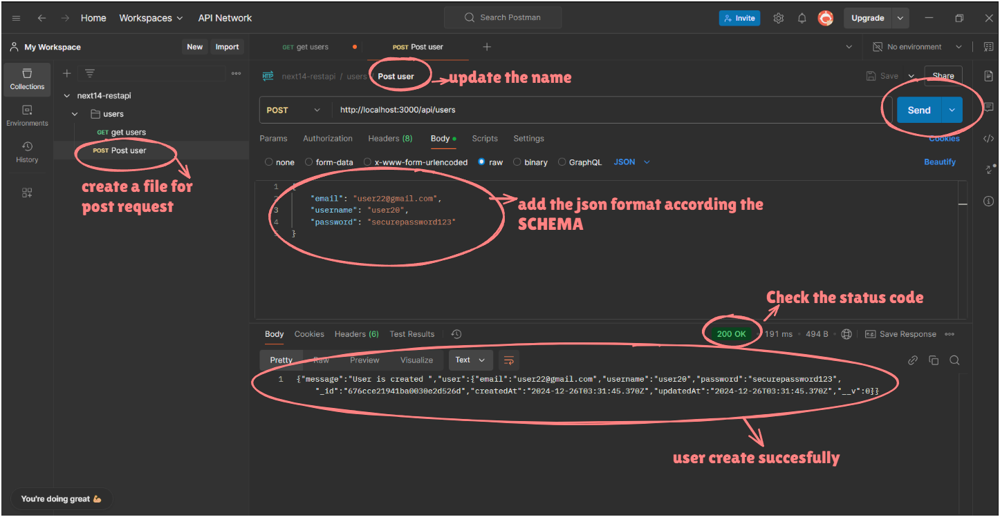
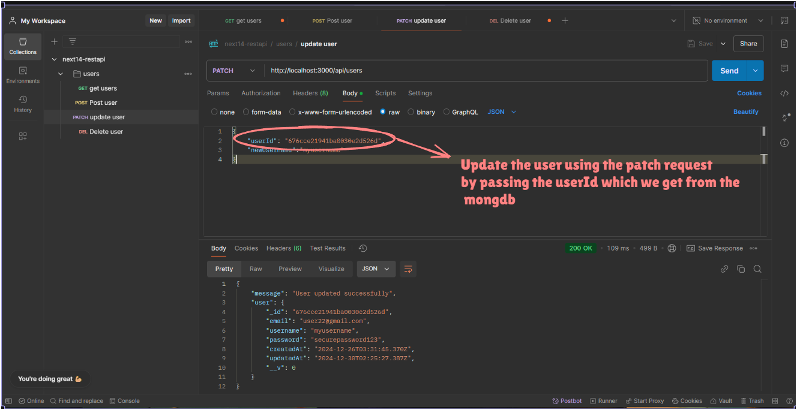

# REST-API-in-NEXT.js

<h1>Topics</h1>
<h4>Create next.js 14 project,
API folder /files structure in next.js 14+ app directory,
Connecting with database ,
Build relational data models ,
Build API endpoints ,
Add filtering , searching , pagination ,
Protect API's,
Middlewares ,
Deployment </h4>

<h1>Steps </h1>
->api/user will the name of the URL of the API and make a file route.ts
(name should be the same )

->api / (auth )/users will be the name of the URL of the API and make a file route.ts
(the bracket should not be count )

->Create a custer in Mongodb and add the mongodb url in the .env file

->create a lib folder and add db.ts file in it to connect to see the database connection status

->create a model folder and add user.ts file in it to create a user model in lib/models/users

->Create a get request in routes.ts file to get all users from the user model and run the code

-> The user is created in the collection that means our DB connection is successful

-> Go to the postman and

-> Here the Database is working properly
